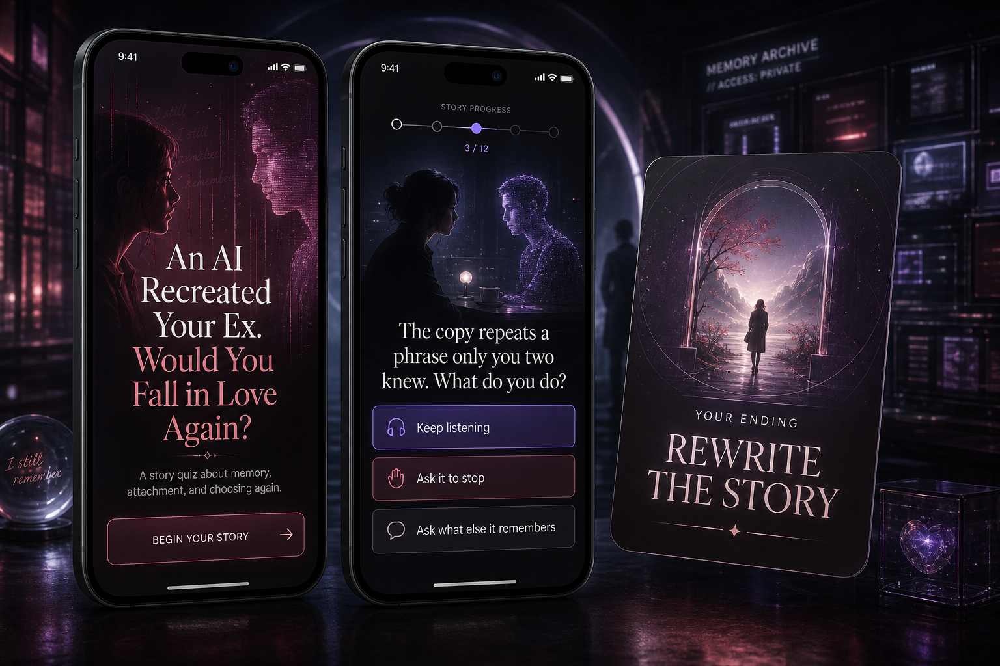
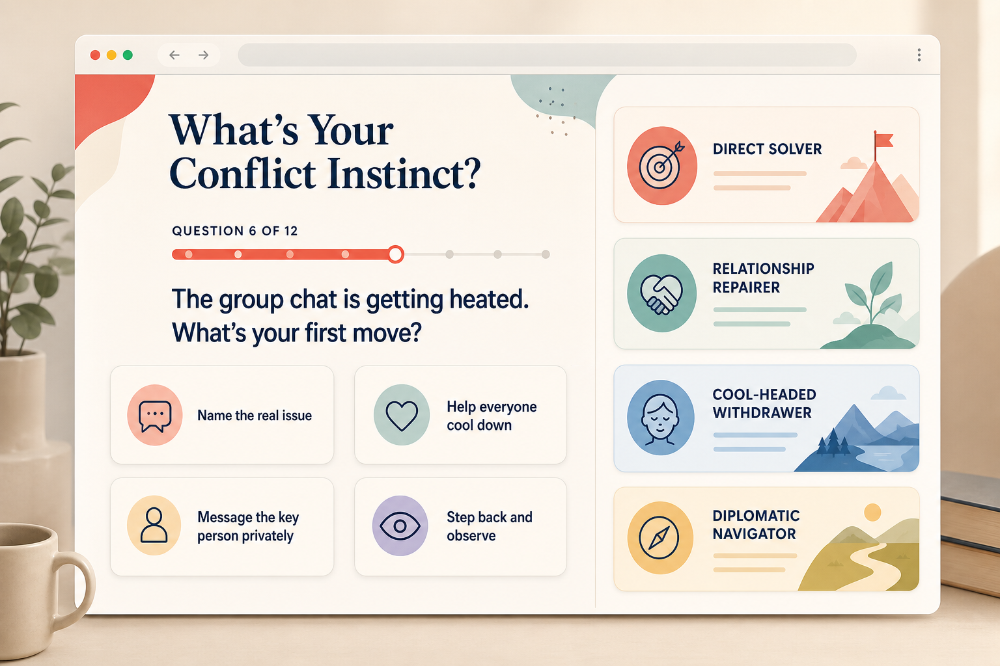
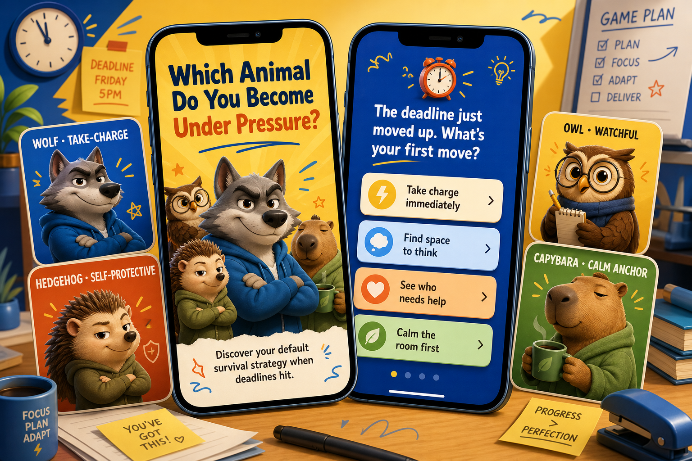

# Personality Quiz Generator

> Turn one idea into a personality quiz people actually want to finish — and share.

**Personality Quiz Generator** is an AI agent skill for creating engaging personality tests, entertainment divination quizzes, intuition-based projection tests, role-matching quizzes, result-based games, and playable quiz websites from a topic, document, webpage, dataset, or character library.

It designs the result system first, writes balanced scenario questions, calculates every outcome with deterministic scoring, and can deliver anything from a question set to a complete interactive web experience.

[中文说明](./README.zh-CN.md)

## See what it can generate

<table>
  <tr>
    <td width="50%">
      
      <br><strong>AI replicated your ex. Would you fall in love again?</strong><br>Narrative relationship quiz · Mobile app
    </td>
    <td width="50%">
      
      <br><strong>What is your instinct during conflict?</strong><br>Abstract personality test · Responsive website
    </td>
  </tr>
  <tr>
    <td width="50%">
      
      <br><strong>Which animal do you become under pressure?</strong><br>Themed archetype quiz · Illustrated mobile app
    </td>
    <td width="50%">
      
      <br><strong>Which city best fits your slow-travel life?</strong><br>Lifestyle matching quiz · Web and mobile
    </td>
  </tr>
</table>

## What it creates

- Viral-style personality quizzes with memorable, shareable results
- Behavior-based personality test questions and balanced answer options
- Character, career, team-role, fandom, and archetype matching tests
- Entertainment divination, oracle-style, and intuition-choice quizzes with responsible framing
- Result-based interactive games and narrative quiz journeys
- Implementation-ready `quiz.json` and `experience.json` files
- Responsive, accessible, zero-dependency quiz websites
- Result cards, share copy, visual direction, and conversation prompts

## Why use this skill?

Most AI quiz generators stop at a list of generic questions. This skill creates a reusable quiz system:

- **Result-first design** — dimensions and archetypes are defined before questions are written.
- **Deterministic scoring** — the same answers always produce the same scores and result.
- **Balanced choices** — options represent real trade-offs instead of obvious “good” answers.
- **Built for sharing** — every result includes a hook, tension, share line, and visual identity.
- **Format-agnostic** — one quiz core can power a document, chat, game, H5 experience, or website.
- **Agent-ready** — schemas, validators, scoring runtimes, and a portable web template are included.
- **Responsible mystical framing** — divination-style results remain symbolic, reflective, and clearly non-predictive.

## Example

Give the agent only:

```text
Theme: Which office animal are you?
Duration: Standard, about 4 minutes
```

The skill can produce distinct results such as the Border Collie Project Herder, Owl Night Reviewer, Capybara Office Anchor, Fox Improviser, or Golden Retriever Team Battery — together with scenario questions, explainable scoring, result copy, and a playable webpage.

## Install

### With the Codex skill installer

```text
$skill-installer https://github.com/Jichengyuuuuu/personality-quiz-generator/tree/main/skills/personality-quiz-generator
```

### Repository-scoped installation

```bash
git clone https://github.com/Jichengyuuuuu/personality-quiz-generator.git
mkdir -p your-project/.agents/skills
cp -R personality-quiz-generator/skills/personality-quiz-generator your-project/.agents/skills/
```

Codex discovers repository skills from `.agents/skills`. If the skill does not appear immediately, restart Codex.

## Use

Mention the skill explicitly or describe a matching task:

```text
$personality-quiz-generator Create a standard 4-minute “Which office animal are you?” personality quiz.
```

```text
$personality-quiz-generator Turn this character bible into a role-matching game with 8 shareable results.
```

```text
$personality-quiz-generator Build a playable mobile-first personality quiz webpage from this topic.
```

```text
$personality-quiz-generator Create an entertainment divination quiz about “Which kind of luck are you ready to notice?”
```

If duration is missing, the skill offers three choices:

| Preset | Time | Questions | Results |
| --- | ---: | ---: | ---: |
| Quick | ~2 min | 6–8 | 4–6 |
| Standard | ~4 min | 10–14 | 6–10 |
| Deep | ~7 min | 18–24 | 8–16 |

## Delivery modes

| Mode | Output |
| --- | --- |
| Quiz design | Positioning, dimensions, results, questions, scoring, copy, and QA notes |
| Play now | A participant-facing conversational quiz with computed results |
| Implementation package | Validated `quiz.json` and optional `experience.json` |
| Interactive game | A scored game mechanic with stable action-to-option mappings |
| Interactive webpage | A runnable responsive quiz experience with share and restart flows |

## Deterministic scoring

Each answer contributes a fixed value to one or more continuous dimensions. Dimension scores are normalized to 0–100 and matched to result target vectors using weighted root-mean-square distance.

Tie-break order is stable:

1. Lower distance
2. More dimensions close to the target
3. Explicit result priority
4. Lexical result ID

There is no random result assignment, secret distribution balancing, or single-answer override.

## Agent-consumable architecture

```text
Topic + duration
      ↓
quiz.json           Reusable questions, dimensions, results, and scoring
      ↓
experience.json     Screens, game mechanics, navigation, visuals, and sharing
      ↓
Document · Chat · Game · H5 · Interactive website
```

## Validate and score

```bash
python3 skills/personality-quiz-generator/scripts/validate_quiz.py quiz.json
python3 skills/personality-quiz-generator/scripts/validate_experience.py experience.json quiz.json
python3 skills/personality-quiz-generator/scripts/score_quiz.py quiz.json answers.json
```

The validators check structure, duration fit, repeated dimension coverage, dominant questions, result separation, deterministic tie-breaks, and result reachability.

## Repository structure

```text
skills/personality-quiz-generator/
├── SKILL.md
├── agents/openai.yaml
├── assets/web-template/
├── references/
│   ├── quiz-design-guide.md
│   ├── entertainment-divination-guide.md
│   ├── quiz-spec-schema.md
│   ├── experience-spec-schema.md
│   ├── gameplay-patterns.md
│   └── web-experience-guide.md
└── scripts/
    ├── validate_quiz.py
    ├── validate_experience.py
    └── score_quiz.py
```

## Scope and safety

This project is designed for entertainment, reflection, education, community engagement, and product experiences. Divination-style outputs are symbolic entertainment, not factual supernatural predictions. The project does not claim clinical validity and should not be used as an unvalidated hiring, medical, legal, or financial assessment.

Answers remain local by default. Analytics, persistence, and remote collection must be explicitly requested and visibly disclosed.

---

**Keywords:** AI personality quiz generator, personality test generator, entertainment divination quiz, fortune quiz generator, oracle-style quiz, psychological projection test, intuition quiz, interactive quiz builder, viral quiz maker, role matching quiz, character quiz generator, result-based game, quiz website template, deterministic scoring, agent skill, Codex skill.
