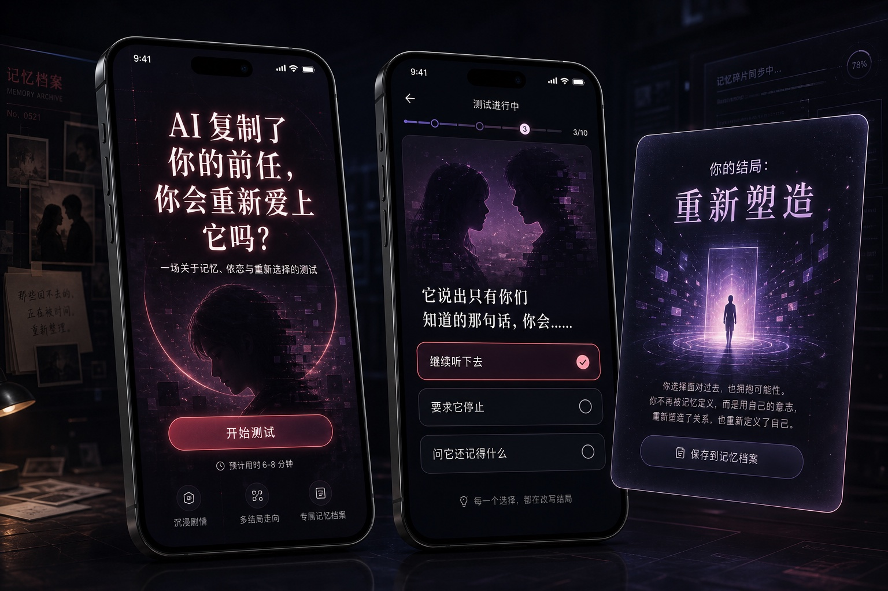
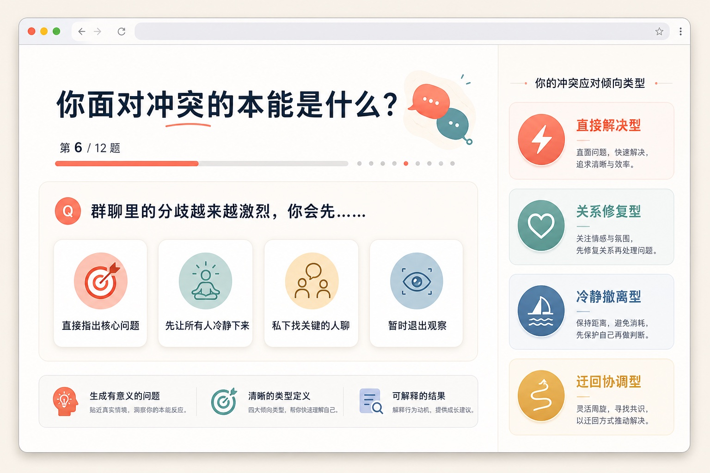
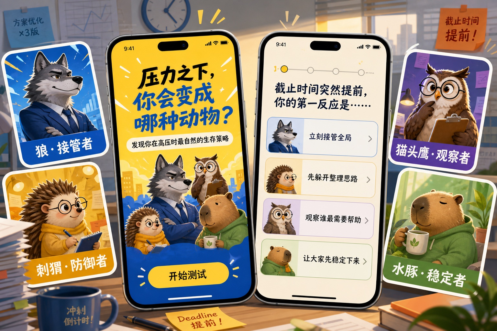

# Personality Quiz Generator｜AI 性格测试、趣味占卜与互动答题生成器

> 把一个想法，变成让人愿意答完、认领并分享的性格测试。

**Personality Quiz Generator** 是一个面向 AI Agent 的性格测试生成 Skill。它可以根据一个主题、文档、网页、数据集或人物设定，生成有趣的性格测试、趣味占卜、直觉投射测试、角色匹配题、结果型互动游戏，以及可直接运行的测试网页。

它不只是罗列问题，而是先建立结果与维度，再生成行为情境题，通过确定性计分得到可解释的结果，并补齐结果文案、分享卡片、视觉方向和互动体验。

[English](./README.md)

## 看一眼就知道它能生成什么

<table>
  <tr>
    <td width="50%">
      
      <br><strong>AI 复制了你的前任，你会重新爱上它吗？</strong><br>剧情关系测试 · 移动端 App
    </td>
    <td width="50%">
      
      <br><strong>你面对冲突的本能是什么？</strong><br>抽象人格测试 · 响应式网站
    </td>
  </tr>
  <tr>
    <td width="50%">
      
      <br><strong>压力之下，你会变成哪种动物？</strong><br>趣味原型测试 · 插画移动端 App
    </td>
    <td width="50%">
      
      <br><strong>测试最适合你旅居的城市</strong><br>生活方式匹配 · 网页与移动端
    </td>
  </tr>
</table>

## 它能生成什么

- 有传播感、适合截图分享的趣味性格测试
- 基于行为场景的题目与吸引力相近的选项
- 职业、团队角色、人物、IP、世界观和原型匹配测试
- 明确标注娱乐属性的趣味占卜、直觉选择和心理投射测试
- 情境冒险、卡片选择等结果型互动小游戏
- 可供 Agent 和程序消费的 `quiz.json`、`experience.json`
- 响应式、无依赖、可直接运行的互动测试网页
- 完整结果文案、分享话术、结果卡和视觉方向

## 为什么不是普通的 AI 出题 Prompt

- **先设计结果，再设计题目**：避免题目和结果各说各话。
- **计分确定且可复现**：同一套答案始终得到相同结果。
- **选项没有标准答案**：每个选择都是一种合理策略，而不是好坏判断。
- **结果值得分享**：每种结果都有身份钩子、优势、代价和讨论话题。
- **一套内核，多种形态**：同一份测试可生成文档、对话、游戏、H5 或网页。
- **适合 Agent 接力生产**：内置 Schema、校验器、计分器和网页模板。
- **负责任的占卜表达**：结果保持象征性、启发性，不冒充真实预测。

## 一个最小输入示例

只需要告诉 Agent：

```text
测试主题：你是哪种办公室动物？
测试时长：标准版，约 4 分钟
```

Skill 就可以生成边牧·进度牧羊人、猫头鹰·深夜审稿官、水豚·办公室定海神针、狐狸·临场解题王等差异明显的结果，并补齐情境题、计分规则、结果解释和互动网页。

## 安装

### 使用 Codex Skill Installer

```text
$skill-installer https://github.com/Jichengyuuuuu/personality-quiz-generator/tree/main/skills/personality-quiz-generator
```

### 安装到当前项目

```bash
git clone https://github.com/Jichengyuuuuu/personality-quiz-generator.git
mkdir -p 你的项目/.agents/skills
cp -R personality-quiz-generator/skills/personality-quiz-generator 你的项目/.agents/skills/
```

Codex 会自动发现 `.agents/skills` 中的 Skill。如果没有立即出现，重启 Codex 即可。

## 使用方式

```text
$personality-quiz-generator 生成“你是哪种办公室动物”标准版性格测试。
```

```text
$personality-quiz-generator 根据这份人物设定，生成包含 8 种结果的角色匹配小游戏。
```

```text
$personality-quiz-generator 根据这个主题，生成一个移动端优先、可以直接玩的性格测试网页。
```

```text
$personality-quiz-generator 生成“最近哪种好运值得你留意”的趣味占卜测试。
```

如果没有提供时长，Skill 会让用户选择：

| 版本 | 时间 | 题量 | 结果数量 |
| --- | ---: | ---: | ---: |
| 极速版 | 约 2 分钟 | 6–8 题 | 4–6 种 |
| 标准版 | 约 4 分钟 | 10–14 题 | 6–10 种 |
| 深度版 | 约 7 分钟 | 18–24 题 | 8–16 种 |

## 支持的交付形态

| 交付模式 | 产物 |
| --- | --- |
| 测试设计 | 定位、维度、结果、题目、计分、结果文案和质量报告 |
| 直接答题 | Agent 在对话中逐题互动并计算结果 |
| 实现配置 | 经过校验的 `quiz.json` 与 `experience.json` |
| 互动游戏 | 选择动作能够稳定映射到计分选项的小游戏 |
| 互动网页 | 包含封面、进度、结果、分享和重测的可运行网页 |

## 确定性计分

每个选项都会对一个或多个连续维度产生固定贡献。维度归一化为 0–100 分，再使用加权均方根距离匹配结果目标向量。

结果排序固定遵循：

1. 与目标向量距离更近
2. 更多维度接近目标
3. 结果优先级更高
4. 结果 ID 字典序

不会随机分配结果、偷偷平衡结果分布，也不会用某一道无关题目覆盖完整答题结果。

## 面向 Agent 的双层结构

```text
主题＋时长
    ↓
quiz.json           题目、选项、维度、结果与计分
    ↓
experience.json     页面、玩法、流程、视觉与分享
    ↓
文档 · 对话 · 游戏 · H5 · 互动网页
```

## 校验与计分

```bash
python3 skills/personality-quiz-generator/scripts/validate_quiz.py quiz.json
python3 skills/personality-quiz-generator/scripts/validate_experience.py experience.json quiz.json
python3 skills/personality-quiz-generator/scripts/score_quiz.py quiz.json answers.json
```

校验器会检查题量与时长、维度覆盖、单题权重、结果区分度、确定性平局规则和结果可达性。

## 使用边界

本项目适用于娱乐、自我观察、教育、社群互动和产品活动。占卜类结果仅作象征性娱乐，不构成真实预测。本项目不宣称具备临床效度，也不应作为未经验证的招聘、医疗、法律或金融决策工具。

默认不采集答案和埋点。如需持久化或统计，必须明确提出，并在测试开始前向参与者说明。

---

**关键词：** AI 性格测试生成器、性格测试题目、趣味测试、人格测试、趣味占卜、占卜测试、运势测试、心理投射测试、直觉选择测试、互动答题、角色匹配测试、测试小游戏、H5 测试、测试网页、结果卡、确定性计分、Agent Skill、Codex Skill。
